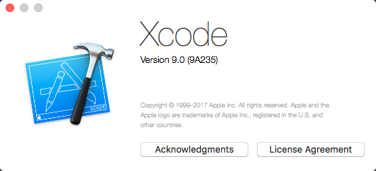
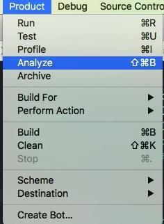
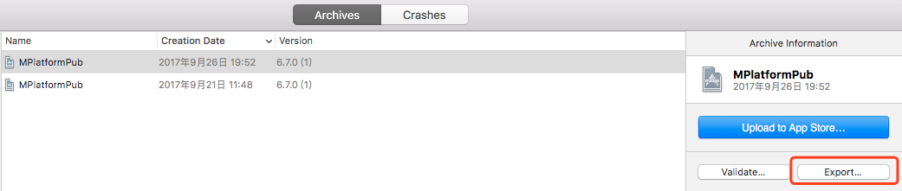
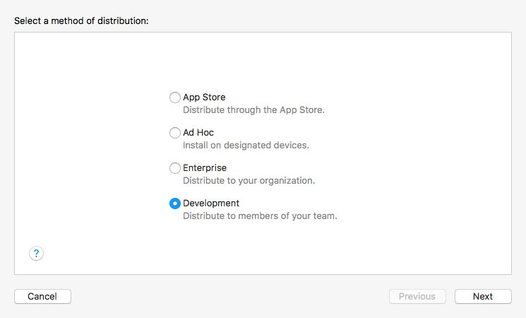
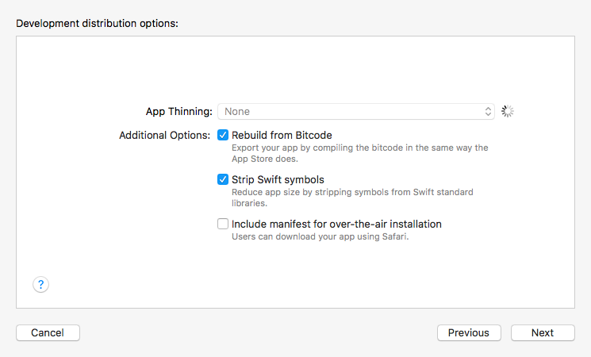
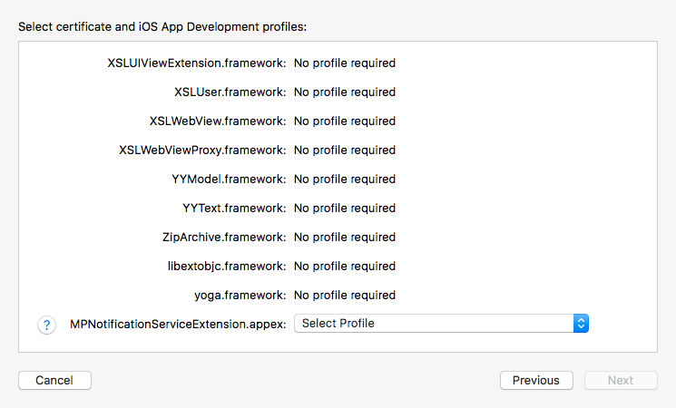

前言
==

在你的`iOS`团队中，如果在使用持续集成来完成自动化打包分发的工作，你可能会了解如何使用一些命令行工具来构建`ipa`文件，其中一款使用较为广泛的是`xcodebuild`。

在我们的团队中有部分打包工作就是使用的`xcodebuild`，脚本代码大概如下：

```
ipaName = "${scheme}${buildConfiguration}"
// archive
xcodebuild -workspace ProjectName.xcworkspace -scheme ${scheme} -configuration ${buildConfiguration} clean archive -archivePath ./${ipaName}.xcarchive
// export
xcodebuild -exportArchive -archivePath ${ipaName}.xcarchive -exportOptionsPlist exportOptions_dev.plist -exportPath ./

* 1
* 2
* 3
* 4
* 5

```

exportOptions\_dev文件如下：

```
\<?xml version="1.0" encoding="UTF-8"?\>
\<!DOCTYPE plist PUBLIC "-//Apple//DTD PLIST 1.0//EN" "http://www.apple.com/DTDs/PropertyList-1.0.dtd"\>
\<plist version="1.0"\>
\<dict\>
    \<key\>method\</key\>
    \<string\>development\</string\>
    \<key\>teamID\</key\>
    \<string\>yourTeamID\</string\>
\</dict\>
\</plist\>

* 1
* 2
* 3
* 4
* 5
* 6
* 7
* 8
* 9
* 10

```

以上配置在`Xcode8`及以下版本都可以正常运行的，在升级`Xcode9`以后上面的脚本会在`export`阶段出错。

一、现象
====

* xcodebuild + Xcode9 
使用`xcodebuild`做打包构建时，执行`exportArchive`命令出错，错误信息：

```
error: exportArchive: "AppName.app" requires a provisioning profile with the Push Notifications and App Groups features.
Error Domain=IDEProvisioningErrorDomain Code=9
"AppName.app" requires a provisioning profile with the Push Notifications and App Groups features." UserInfo={NSLocalizedDescription="AppName.app" requires a provisioning profile with the Push Notifications and App Groups features., NSLocalizedRecoverySuggestion=Add a profile to the "provisioningProfiles" dictionary in your Export Options property list.} // 或 "Error Domain=IDEProvisioningErrorDomain Code=9 \"\\"ios-simple-objc.app\\" requires a provisioning profile.\\" UserInfo={NSLocalizedDescription=\\"ios-simple-objc.app\\" requires a provisioning profile., NSLocalizedRecoverySuggestion=Add a profile to the \\"provisioningProfiles\\" dictionary in your Export Options property list.}"

* 1
* 2
* 3
* 4
* 5
* 6

```

二、原因
====

Xcode9 的打包需要指定以下信息，才能完成`export`操作： 
- provisioningProfiles 
- compileBitcode 
- method 
- signingCertificate 
- signingStyle 
- stripSwiftSymbols 
- teamID 
- thinning

三、解决步骤
======

你需要使用`Xcode9`先手动构建一次，使用构建生成的`plist`配置就可以完成`export`操作。 
1\. 使用`Xcode9`打开你的工程 


1. 执行打包操作：Product -\> Archive 

2. 打包完成后执行`export`操作（其中会需要你手动选择你的相关`provison profile`等信息），`Xcode9`会自动生成`exportOptionsPlist`文件，同时拷贝到你生成的`ipa`包的同级目录下。









1. 直接使用`Xcode9`自动生成的`exportOptionsPlist`文件来进行`xcodebuild`的`export`操作，或者拷贝文件内容到你原来的`exportOptionsPlist`文件。

```
// Xcode9 export 生成的文件
DistributionSummary.plist
ExportOptions.plist
AppName.ipa
Packaging.log

* 1
* 2
* 3
* 4
* 5

```

四、解决方案

原因分析：取不到provisioningProfiles的信息
解决方案：在Export Options plist文件里添加以下内容

\<key\>provisioningProfiles\</key\> \<dict\> \<key\>com.lianjia.name\</key\> \<string\>{iOS Provisioning Profiles Name}\</string\> \</dict\>

五、示例

```
\<?xml version="1.0" encoding="UTF-8"?\> \<!DOCTYPE plist PUBLIC "-//Apple//DTD PLIST 1.0//EN" "http://www.apple.com/DTDs/PropertyList-1.0.dtd"\> \<plist version="1.0"\> \<dict\> \<key\>compileBitcode\</key\> \<true/\> \<key\>method\</key\> \<string\>development\</string\> \<key\>provisioningProfiles\</key\> \<dict\> \<key\>com.xingshulin.abc\</key\> \<string\>abc\_dev\</string\> \<key\>com.xingshulin.abc.NotificationServiceExtension\</key\> \<string\>abc-Notification-dev\</string\> \</dict\> \<key\>signingCertificate\</key\> \<string\>iPhone Developer\</string\> \<key\>signingStyle\</key\> \<string\>manual\</string\> \<key\>stripSwiftSymbols\</key\> \<true/\> \<key\>teamID\</key\> \<string\>yourTeamID\</string\> \<key\>thinning\</key\> \<string\>\<none\>\</string\> \</dict\> \</plist\>
```